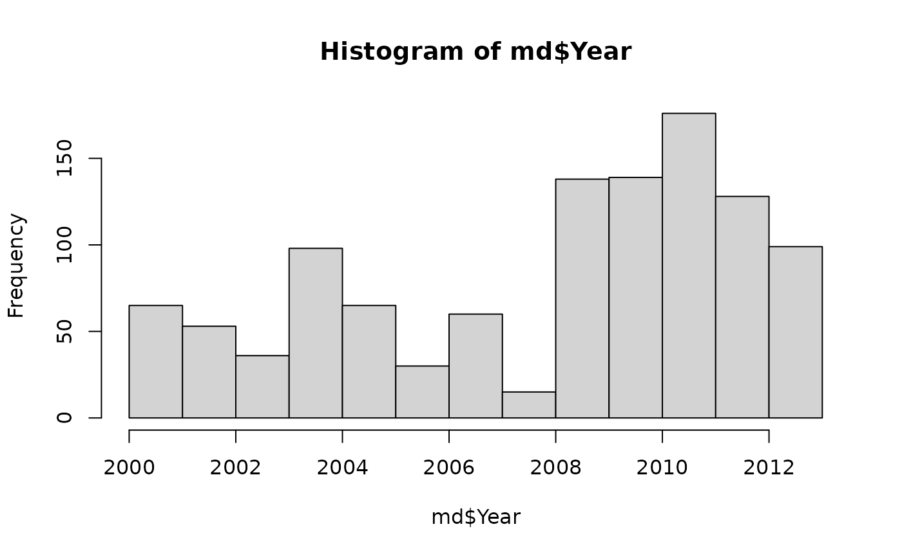
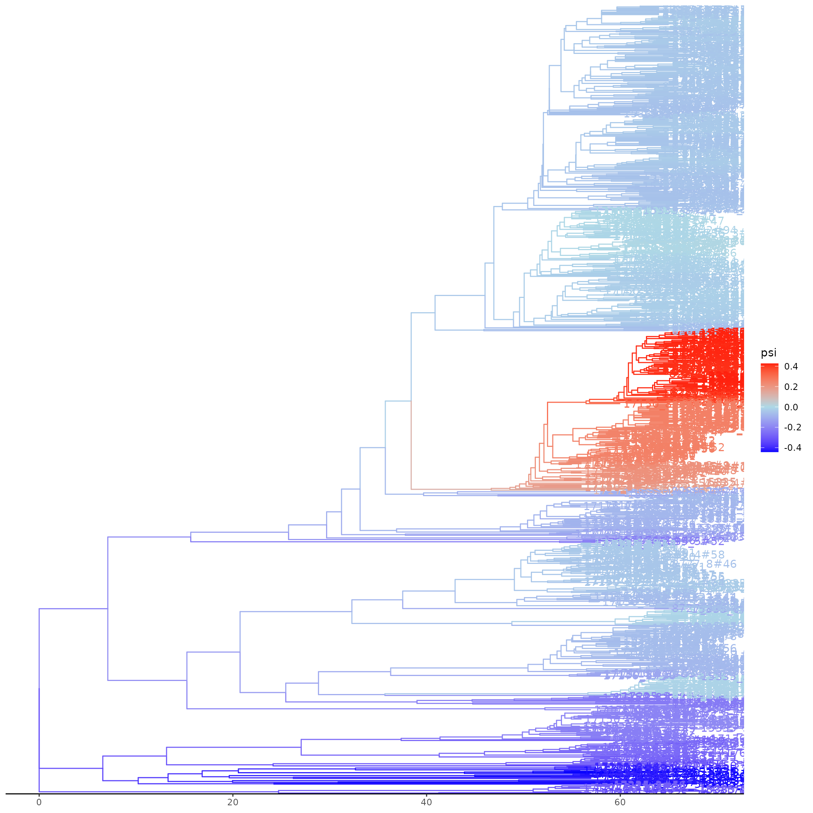
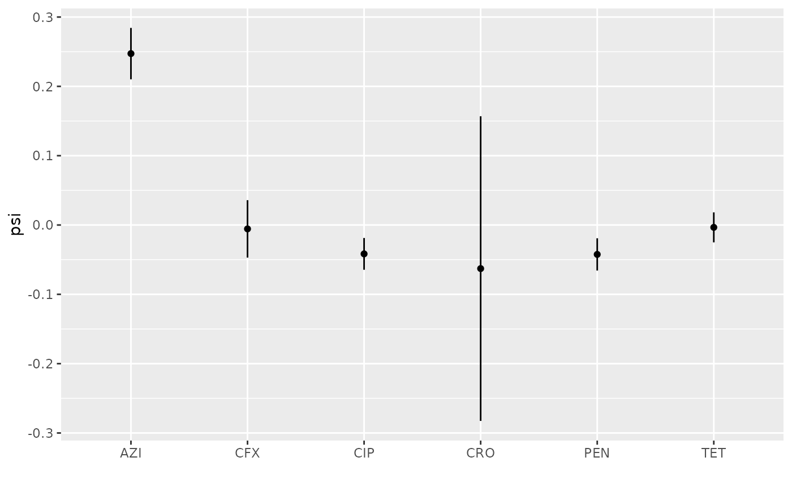

# Neisseria gonorrheae: Computing coalescent odds, identifying growing lineages, cluster identification & sample reweighting

This vignette demonstrates the main functions of `cod` using data from
1,102 Neisseria gonorrhoeae genomes first described in [¹](#fn1). The
data used here were further analysed in [²](#fn2) and the data analysed
here is available at
<https://github.com/emvolz/cod/tree/main/inst/extdata>.

``` r
library(cod)
tr <- ape::read.tree( system.file('extdata/grad2016-treedater-tr1.nwk', package='cod' ) )
md <- read.csv( system.file( 'extdata/grad2016-a2md.csv' , package='cod' ) ) 
```

This is a time-scaled phylogeny estimated using `phyml`, `ClonalFrameML`
and the `treedater` R package.

``` r
tr 
```

    ## 
    ## Phylogenetic tree with 1102 tips and 1101 internal nodes.
    ## 
    ## Tip labels:
    ##   17176_1#21, 15335_3#33, 15335_6#51, 15335_4#63, 15335_5#50, 8727_8#36, ...
    ## 
    ## Rooted; includes branch length(s).

Metadata includes the year of sample collection, clinic where the sample
was collected, and resistance scores to several classes of antibiotics.
For the purposes of this vignette, we will consider a score of “2” to
represent resistance.

``` r
head(md)
```

    ##           ID PEN TET SPC CFX CRO CIP AZI Clinic Year
    ## 1  15335_2#1   2   2   0   2   0   2   1    POR 2012
    ## 2 15335_2#10   1   1   0   0   0   0   2    MIN 2005
    ## 3 15335_2#11   1   1   0   0   0   0   2    MIN 2005
    ## 4 15335_2#12   1   2   0   0   0   0   2    LVG 2006
    ## 5 15335_2#13   2   2   0  NA   0   2   2    CHI 2008
    ## 6 15335_2#14   2   2   0  NA   0   0   2    KCY 2008

``` r
hist( md$Year, main = '', ylab = '', xlab = 'Year' )
```



## Estimating coalescent odds

The main function to estimate coalescent odds using weighted least
squares is `codls`:

``` r
f <- codls( tr )
f
```

    ##  Genealogical placement GMRF model fit 
    ## 
    ## Phylogenetic tree with 1102 tips and 1101 internal nodes.
    ## 
    ## Tip labels:
    ##   17176_1#21, 15335_3#33, 15335_6#51, 15335_4#63, 15335_5#50, 8727_8#36, ...
    ## 
    ## Rooted; includes branch length(s).
    ## Range of coefficients: 
    ## -1.12889544705052 1.9085811316829
    ## Precision parameter (log tau): 2.17220420767149

The only required argument is a time-scaled phylogenetic tree. This
method models the correlation of coalescent odds between phylogenetic
lineages using a Gaussian-Markov Random Field which includes a precision
parameter `logtau`. If independently estimated, this can be provided to
`codls` to speed up estimation, but if omitted, `logtau` will be
automatically estimated using the `optcodsmooth` function. You can also
speed up `codls` by using multiple CPUs with the `ncpu` argument.

Plotting the fit will display a tree with estimated log odds of
coalescence mapped by colour on to branches. Note that this requires the
`ggtree` package to be installed.

``` r
# Plot the tree with coalescent odds - handle potential ggtree issues
tryCatch({
  plot(f)
}, error = function(e) {
  cat("Plot generation failed due to ggtree compatibility issue:\n")
  cat(e$message, "\n")
  cat("Tree summary:\n")
  print(f)
  cat("\nCoalescent odds summary:\n")
  print(summary(coef(f)))
})
```



The coalescent odds for each branch can be retrieved using `coef`, e.g.:

``` r
coef(f)[1:4] 
```

    ## [1] 0.004858235 0.104878380 0.145474704 0.203367462

These are in the same order as nodes in the input tree.

Let’s merge the estimated coalescent odds back into the metadata for
subsequent analysis:

``` r
fdf <- data.frame( tip = f$data$tip.label, psi = coef(f)[1:Ntip(tr)] )
md$tip  <- md$ID 
md <- merge( md, fdf, by = 'tip')
head( md )
```

    ##          tip         ID PEN TET SPC CFX CRO CIP AZI Clinic Year        psi
    ## 1  15335_2#1  15335_2#1   2   2   0   2   0   2   1    POR 2012 -0.4367199
    ## 2 15335_2#10 15335_2#10   1   1   0   0   0   0   2    MIN 2005  0.2358685
    ## 3 15335_2#11 15335_2#11   1   1   0   0   0   0   2    MIN 2005  0.2036033
    ## 4 15335_2#12 15335_2#12   1   2   0   0   0   0   2    LVG 2006  0.1989217
    ## 5 15335_2#13 15335_2#13   2   2   0  NA   0   2   2    CHI 2008 -0.2859137
    ## 6 15335_2#14 15335_2#14   2   2   0  NA   0   0   2    KCY 2008 -0.2889254

## Sample weights

If we examine the relationship between coalescent odds and where samples
originated (Clinic) there are a few clinics with significantly higher
values:

``` r
table( md$Clinic ) |> sort() 
```

    ## 
    ## COL LA2 SLC STL FBG GRB IND PON NOR LBC NYC CLE RIC KCY ALB DTR OKC DAL CIN ATL 
    ##   3   3   3   3   4   6   6   6   7   8   8  11  11  13  14  14  14  16  22  25 
    ## BHM MIA SEA DEN BAL HON POR MIN LAX ORA PHX SFO PHI CHI LVG SDG 
    ##  28  28  29  30  33  35  48  51  53  62  64  67  69  71  85 152

``` r
s <- lm( psi ~ Clinic, data = md) |> summary() 
s
```

    ## 
    ## Call:
    ## lm(formula = psi ~ Clinic, data = md)
    ## 
    ## Residuals:
    ##      Min       1Q   Median       3Q      Max 
    ## -1.17016 -0.31795 -0.08085  0.14890  1.88243 
    ## 
    ## Coefficients:
    ##             Estimate Std. Error t value Pr(>|t|)   
    ## (Intercept) -0.08706    0.15173  -0.574  0.56624   
    ## ClinicATL    0.08569    0.18951   0.452  0.65125   
    ## ClinicBAL    0.19265    0.18107   1.064  0.28760   
    ## ClinicBHM   -0.06594    0.18583  -0.355  0.72277   
    ## ClinicCHI    0.15978    0.16601   0.962  0.33604   
    ## ClinicCIN   -0.15816    0.19409  -0.815  0.41531   
    ## ClinicCLE   -0.14502    0.22874  -0.634  0.52622   
    ## ClinicCOL   -0.13869    0.36118  -0.384  0.70107   
    ## ClinicDAL    0.36634    0.20776   1.763  0.07814 . 
    ## ClinicDEN   -0.01967    0.18375  -0.107  0.91479   
    ## ClinicDTR    0.03101    0.21457   0.144  0.88513   
    ## ClinicFBG   -0.10919    0.32186  -0.339  0.73450   
    ## ClinicGRB    0.78823    0.27701   2.845  0.00452 **
    ## ClinicHON    0.06508    0.17952   0.363  0.71704   
    ## ClinicIND    0.08834    0.27701   0.319  0.74987   
    ## ClinicKCY    0.08874    0.21866   0.406  0.68494   
    ## ClinicLA2    0.63990    0.36118   1.772  0.07673 . 
    ## ClinicLAX    0.12362    0.17059   0.725  0.46882   
    ## ClinicLBC   -0.18841    0.25161  -0.749  0.45414   
    ## ClinicLVG   -0.09778    0.16374  -0.597  0.55055   
    ## ClinicMIA    0.43854    0.18583   2.360  0.01846 * 
    ## ClinicMIN    0.05422    0.17129   0.317  0.75163   
    ## ClinicNOR   -0.24982    0.26280  -0.951  0.34201   
    ## ClinicNYC   -0.18111    0.25161  -0.720  0.47180   
    ## ClinicOKC   -0.25290    0.21457  -1.179  0.23881   
    ## ClinicORA    0.14291    0.16799   0.851  0.39512   
    ## ClinicPHI    0.09847    0.16641   0.592  0.55414   
    ## ClinicPHX    0.23628    0.16750   1.411  0.15865   
    ## ClinicPON    0.24875    0.27701   0.898  0.36940   
    ## ClinicPOR    0.09572    0.17244   0.555  0.57896   
    ## ClinicRIC   -0.10540    0.22874  -0.461  0.64503   
    ## ClinicSDG    0.14276    0.15856   0.900  0.36813   
    ## ClinicSEA   -0.10906    0.18475  -0.590  0.55510   
    ## ClinicSFO   -0.02538    0.16683  -0.152  0.87910   
    ## ClinicSLC   -0.27095    0.36118  -0.750  0.45331   
    ## ClinicSTL   -0.19067    0.36118  -0.528  0.59766   
    ## ---
    ## Signif. codes:  0 '***' 0.001 '**' 0.01 '*' 0.05 '.' 0.1 ' ' 1
    ## 
    ## Residual standard error: 0.5677 on 1066 degrees of freedom
    ## Multiple R-squared:  0.06646,    Adjusted R-squared:  0.0358 
    ## F-statistic: 2.168 on 35 and 1066 DF,  p-value: 0.0001154

It is possible that this occurred because these locations were sampled
more intensively than other clinics which can artificially increase
coalescent rates because of higher local density of co-circulating
lineages. Samples can be down-weighted in `codls` by passing the
`*weights*` argument, which should ameliorate bias from over-sampling if
we know how much over-sampling took place. Unfortunately, this is rarely
known, so `cod` includes a routine to consider a range of sample weights
and will identify the maximum weight such that there is no longer a
significant relationship between coalescent odds and a given variable
(usually geographic). Here we identify all samples from the “MIA”
clinical and pass these to the `autoreweight` function.

``` r
# Clinics associated with psi :
signifclinics <- rownames(s$coefficients)[ s$coefficients[ , 4]  < .1 ]
signifclinics <- substr(signifclinics, 7,9 )
# Subset of tips from clinics associated with psi :
reweighttips  <- md$tip[ md$Clinic %in% signifclinics ]
arw <- autoreweight( f, reweighttips, wlb = 1e-2, wub = .5, res = 5, alpha = .02 )
f = arw$fit
arw$summary
```

    ##   sampleweight            p
    ## 1       0.0100 0.0182876306
    ## 2       0.1325 0.0060415712
    ## 3       0.2550 0.0018345749
    ## 4       0.3775 0.0005179955
    ## 5       0.5000 0.0001375240

Note that in some cases, the association will not disappear even if the
weight is zero because lineages surrounding the given samples also have
higher coalescent odds. In these cases, the relationship is more likely
to be authentic. That is exactly what we see here. Even when weighting
these samples at 1% (unrealistically low) there remains a significant
association with coalescent odds. Consequently, this fit will be
identical to the original fit.

## Antibiotic resistance

Here we examine the relationship between coalescent odds and antibiotic
resistance. First, we replot the coloured tree alongside resistance
phenotypes.

``` r
abxs <- c( 'PEN', 'TET', 'CFX', 'CRO', 'CIP', 'AZI')
abxmat <- as.matrix(md[, abxs ] )
abxmat <- apply( abxmat, 2, function(x) (x == "2") ) # The value of '2' is coded as abx resistant
rownames( abxmat ) <- md$tip 
head(abxmat) 
```

    ##              PEN   TET   CFX   CRO   CIP   AZI
    ## 15335_2#1   TRUE  TRUE  TRUE FALSE  TRUE FALSE
    ## 15335_2#10 FALSE FALSE FALSE FALSE FALSE  TRUE
    ## 15335_2#11 FALSE FALSE FALSE FALSE FALSE  TRUE
    ## 15335_2#12 FALSE  TRUE FALSE FALSE FALSE  TRUE
    ## 15335_2#13  TRUE  TRUE    NA FALSE  TRUE  TRUE
    ## 15335_2#14  TRUE  TRUE    NA FALSE FALSE  TRUE

``` r
abxmat[ is.na(abxmat) ] <- FALSE

# Try to create tree plot with heatmap, handle ggtree issues
tryCatch({
  trpl <- plot(f) + 
    ggplot2::scale_color_gradient2( low='blue'
                                  , mid = 'lightblue'
                                  , high = 'red'
                                  , midpoint = 0
                                  , limits = range(fdf$psi)
                                  , name = "ψ" )
  trpl <- ggtree::gheatmap( trpl, abxmat, colnames_position='top', colnames_offset_y = -11)
  trpl$data$label = '' # suppress tip labels 
  print(trpl)
}, error = function(e) {
  cat("Tree plot with heatmap failed due to ggtree compatibility issue:\n")
  cat(e$message, "\n")
  cat("\nAntibiotic resistance summary:\n")
  print(colSums(abxmat))
  cat("\nSamples with highest coalescent odds:\n")
  top_psi <- head(md[order(md$psi, decreasing=TRUE), c("tip", "psi", abxs)], 10)
  print(top_psi)
})
```


It looks like higher coalescent odds are associated with AZI resistance
and no other abx shows a positive effect. Let’s quantify this. Here we
do a linear regression of coalescent odds on each abx and time, then
infer the mean psi at the end of sampling (year 2013).

``` r
md$t  <- md$Year - min(md$Year)
psi2013 <- sapply( abxs, function(x)
{
    md1 <- md
    md1$v <- md1[[x]] == 2
    m = lm( psi ~ v*t  , data = md1 )
    predict( m, newdata= data.frame( psi = NA, v = TRUE, t = 13 ) , interval='confidence')
}) |> setNames( abxs )
ebdf <- as.data.frame( t( psi2013 ) ) 
colnames(ebdf) <- c( 'Median', '2.5%', '97.5%' )
ebdf$abx = rownames( ebdf ) 
ebdf <- ebdf[ order( ebdf$Median ) , ] 
print( ebdf )
```

    ##          Median        2.5%       97.5% abx
    ## CRO -0.33689489 -1.01640541  0.34261563 CRO
    ## PEN -0.13405015 -0.20522152 -0.06287877 PEN
    ## CIP -0.13023070 -0.19953996 -0.06092143 CIP
    ## CFX -0.02911709 -0.15417258  0.09593839 CFX
    ## TET  0.02391297 -0.04309963  0.09092558 TET
    ## AZI  0.89029502  0.77634421  1.00424584 AZI

Here the result is plotted:

``` r
peb = ggplot2::ggplot(ebdf, ggplot2::aes(x = abx, y = Median, ymin = `2.5%`, ymax = `97.5%`) ) + ggplot2::geom_errorbar(width=0) + 
ggplot2::geom_point() + 
ggplot2::labs(y = 'psi', x = '' )
peb
```



In fact, resistance to AZI expanded rapidly after these data were
collected, from a prevalence of 0.6% in 2013 to 4.5% in 2017[³](#fn3).
This is the most rapid growth among these antibiotics.

## Phylogenetic clusters

An alternative way to look at coalescent odds is in terms of
phylogenetic clusters. These are clades defined by a threshold change in
coalescent odds along a lineage, from low to high values. There is some
subjectivity in the choice of clustering thresholds and the best choice
depends on the application, however `cod` provides a method based on the
[Calinski-Harabasz
index](https://en.wikipedia.org/wiki/Calinski%E2%80%93Harabasz_index).

``` r
chis <- chindices(f, clths = seq( .03, .4, length = 20 ), rescale=TRUE)
chis
```

    ##     threshold         CH optimal
    ## 1  0.03000000   3111.261        
    ## 2  0.04947368   6462.252        
    ## 3  0.06894737  10778.941        
    ## 4  0.08842105  14680.318        
    ## 5  0.10789474  21507.628        
    ## 6  0.12736842  29094.522        
    ## 7  0.14684211  29271.671        
    ## 8  0.16631579  37338.379        
    ## 9  0.18578947  46129.976        
    ## 10 0.20526316  56708.829        
    ## 11 0.22473684  59308.878        
    ## 12 0.24421053  58146.264        
    ## 13 0.26368421  72607.117        
    ## 14 0.28315789  62908.156        
    ## 15 0.30263158  67294.613        
    ## 16 0.32210526  81134.673        
    ## 17 0.34157895  96503.181        
    ## 18 0.36105263 117905.819        
    ## 19 0.38052632 126070.206        
    ## 20 0.40000000 160636.312     ***

Here, we compute clusters using the maximum CH index. Note that if no
threshold is provided, `computeclusters` will automatically select the
optimal threshold:

``` r
# Using optimal threshold from CH index
chdf = computeclusters(f, chis$threshold[which.max(chis$CH)] )
# Alternatively, let computeclusters automatically select optimal threshold:
# chdf = computeclusters(f)  
head(chdf)
```

    ##   node  tip.label clusterid        psi  tip
    ## 1  986 15335_2#43         1 -0.2610328 TRUE
    ## 2  987 15335_4#44         1 -0.2610328 TRUE
    ## 3  988 15335_4#19         1 -0.2565474 TRUE
    ## 4  989 17225_3#73         1 -0.2204023 TRUE
    ## 5  990 17176_1#34         1 -0.2171693 TRUE
    ## 6  991 17225_3#89         1 -0.2582032 TRUE

Plotting this shows that one cluster very closely matches a clade with
high levels of AZI resistance and high coalescent odds, so an
alternative way to analyse these data would be to identify clusters with
high coalescent odds and then characterise resistance patters within
these clusters. The clusters can be visualised by running
`plotclusters(f, chdf)`.


Cluster visualization showing phylogenetic tree with heatmap of cluster
assignments

``` r
# Cluster summary statistics
cat("Cluster summary:\n")
```

    ## Cluster summary:

``` r
print(table(chdf$clusterid))
```

    ## 
    ##   1   2   3   4   5   6   7   8   9  10  11  12  13  14 
    ##  22 104  88  92   4 192   3 140  47 141   3 575 308 616

``` r
cat("\nCluster statistics (coalescent odds by cluster):\n")
```

    ## 
    ## Cluster statistics (coalescent odds by cluster):

``` r
cluster_stats <- aggregate(chdf$psi, by=list(chdf$clusterid),
                           function(x) c(mean=mean(x, na.rm=TRUE),
                                       sd=sd(x, na.rm=TRUE),
                                       n=length(x)))
names(cluster_stats) <- c("cluster", "psi_stats")
print(cluster_stats)
```

    ##    cluster psi_stats.mean  psi_stats.sd   psi_stats.n
    ## 1        1   -0.341212048   0.171619309  22.000000000
    ## 2        2    0.381617700   0.254668680 104.000000000
    ## 3        3    0.363007212   0.214765365  88.000000000
    ## 4        4   -0.175488735   0.208121259  92.000000000
    ## 5        5   -0.887119967   0.144975491   4.000000000
    ## 6        6    1.548975084   0.213336390 192.000000000
    ## 7        7    0.710763879   0.199858674   3.000000000
    ## 8        8    0.084002855   0.138217162 140.000000000
    ## 9        9   -0.221995933   0.121345282  47.000000000
    ## 10      10   -0.224530136   0.166636298 141.000000000
    ## 11      11   -0.655195021   0.272068455   3.000000000
    ## 12      12   -0.206051956   0.192692458 575.000000000
    ## 13      13    0.003235142   0.383942098 308.000000000
    ## 14      14   -0.286349103   0.293983310 616.000000000

## References

------------------------------------------------------------------------

1.  Grad Y.H. , Harris S.R., Kirkcaldy R.D., Green A.G., Marks D.S.,
    Bentley S.D., Trees D., Lipsitch M. 2016. Genomic epidemiology of
    gonococcal resistance to extended-spectrum cephalosporins,
    macrolides, and fluoroquinolones in the United States, 2000-2013. J.
    Infect. Dis. 214:1579-1587.

2.  Erik M Volz, Wiuf Carsten, Yonatan H Grad, Simon D W Frost, Ann M
    Dennis, Xavier Didelot, Identification of Hidden Population
    Structure in Time-Scaled Phylogenies, Systematic Biology, Volume 69,
    Issue 5, September 2020, Pages 884–896,
    <https://doi.org/10.1093/sysbio/syaa009>

3.  Centers for Disease Control and Prevention. (2018). Sexually
    transmitted disease surveillance 2017. U.S. Department of Health and
    Human Services.
