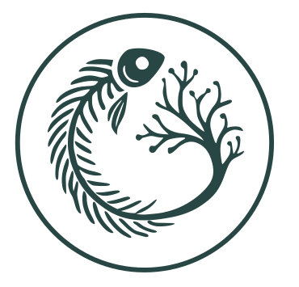

# `cod`: Inference of Coalescent ODds in Phylogenetic Trees



[](https://opensource.org/licenses/MIT)

## Overview

The `cod` R package provides tools for inferring variation in coalescent
rates across branches in phylogenetic trees. It provides methods to
identify growing lineages, adjust for biased sampling, compute
phylogenetic clusters, optimize cluster thresholds, and summarize rate
variations.

For worked examples and detailed usage, see package documentation and
vigettes at <https://emvolz.github.io/cod/>.

## Installation

You can install `cod` from GitHub using `devtools`:

``` r
# install.packages("devtools")
devtools::install_github("emvolz/cod")
```

## Dependencies

The package requires several dependencies: - Matrix (\>= 1.7) - ape (\>=
5.0) - glue (\>= 1.0.0) - mgcv (\>= 1.9-1) - parallel

Optional packages for visualization: - ggtree (\>= 3.12.0) - ggplot2
(\>= 3.0.0)

## Key Features

### Estimating Coalescent Odds

The main function
[`codls()`](https://emvolz.github.io/cod/reference/codls.md) estimates
coalescent odds using weighted least squares:

``` r
# Load a phylogenetic tree
tr <- ape::read.tree("your_tree_file.nwk")

# Fit the COD GMRF model
f <- codls(tr)

# View summary
summary(f)

# Plot the results (requires ggtree)
plot(f)
```

### Phylogenetic Clustering

Identify clusters in phylogenetic trees based on coalescent odds:

``` r
# Find optimal clustering threshold
chis <- chindices(f, clths = seq(0.1, 1.5, length = 20))

# Compute clusters
clusterdf <- computeclusters(f, clth = chis$threshold[which.max(chis$CH)])

# Plot clusters (requires ggtree)
plotclusters(f, clusterdf)
```

### Adjusting for Sampling Bias

Correct for biased sampling using the sample reweighting method:

``` r
# Identify tips to reweight
reweight_tips <- c("tip1", "tip2", "tip3")

# Automatically determine optimal reweighting
reweightedfit <- autoreweight(f, reweight_tips)
```

## Documentation

For detailed documentation on functions and their parameters, use the R
help system and vignettes:

``` r
?codls
?computeclusters
?autoreweight
```

## Citation

A manuscript describing the methods in this package is currently in
preparation.

## License

This package is available under the MIT License. See the LICENSE file
for more information.
