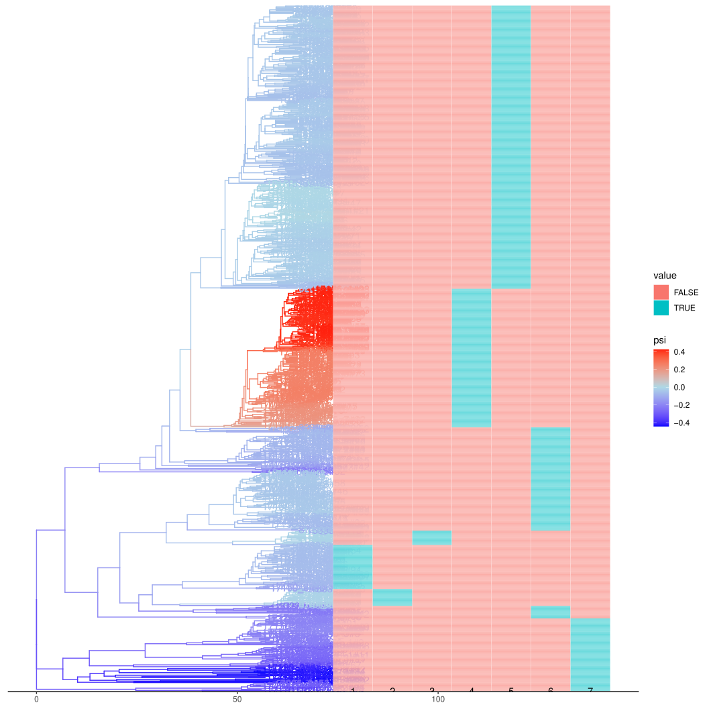

This vignette demonstrates the main functions of `cod` using data from 1,102 Neiseria gonorrhoeae genomes first described in [^grad].  The data used here were further analysed in [^volz] and this version of the data are available at [https://github.com/xavierdidelot/gonophylo](https://github.com/xavierdidelot/gonophylo). 
```{r setup, include=FALSE}
knitr::opts_chunk$set(echo = TRUE, warning = FALSE, message = FALSE)
# Set option to ignore negative edge lengths for plotting
options(ignore.negative.edge=TRUE)
```

```{r}
library(cod)
tr <- ape::read.tree( system.file('extdata/grad2016-treedater-tr1.nwk', package='cod' ) )
md <- read.csv( system.file( 'extdata/grad2016-a2md.csv' , package='cod' ) ) 
```

This is a time-scaled phylogeny estimated with the `treedater` R package. 
```{r}
tr 
```

Metadata includes the year of sample collection, clinic where the sample was collected, and resistance scores to several classes of antibiotics. For the purposes of this vignette, we will consider a score of "2" to represent resistance. 
```{r}
head(md)
hist( md$Year, title = '', ylabel = '', xlabel = 'Year' )
```

# Estimating coalescent odds 

The main function to estimate coalescent odds using weighted least squares is `codls`: 
```{r}
f <- codls( tr )
f
```
The only required argument is a time-scaled phylogenetic tree. This method models the correlation of coalescent odds between phylogenetic lineages using a Gaussian-Markov Random Field which includes a precision parameter `logtau`. If indepently estimated, this can be provided to `codls` to speed up estimation, but if omitted, `logtau` will be automatically estimated using the `tauprofile` function. You can also speed up `codls` by using multiple CPUs with the `ncpu` argument. 

Plotting the fit will display a tree with estimated log odds of coalescence mapped by colour on to branches. Note that this requires the `ggtree` package to be installed. 
```{r, fig.width=11, fig.height=11}
# Plot the tree with coalescent odds - handle potential ggtree issues
tryCatch({
  plot(f)
}, error = function(e) {
  cat("Plot generation failed due to ggtree compatibility issue:\n")
  cat(e$message, "\n")
  cat("Tree summary:\n")
  print(f)
  cat("\nCoalescent odds summary:\n")
  print(summary(coef(f)))
})
```

The coalescent odds for each branch can be retrieved using `coef`, e.g.:
```{r}
coef(f)[1:4] 
```
These are in the same order as nodes in the input tree.  


Let's merge the estimated coalescent odds back into the metadata for subsequent analysis:
```{r}
fdf <- data.frame( tip = f$data$tip.label, psi = coef(f)[1:Ntip(tr)] )
md$tip  <- md$ID 
md <- merge( md, fdf, by = 'tip')
head( md )
```


# Sample weights 

If we examine the relationship between coalescent odds and where samples originated (Clinic) there are a few clinics with significantly higher values: 
```{r}
table( md$Clinic ) |> sort() 
s <- lm( psi ~ Clinic, data = md) |> summary() 
s
```

It is possible that this occurred because these locations were sampled more intensively than other clinics which can artificially increase coalescent rates because of higher local density of co-circulating lineages.  Samples can be down-weighted in `codls` by passing the `*weights*` argument, which should ameliorate bias from over-sampling if we know how much over-sampling took place. Unfortunately, this is rarely known, so `cod` includes a routine to consider a range of sample weights and will identify the maximum weight such that there is no longer a significant relationship between coalescent odds and a given variable (usually geographic). Here we identify all samples from the "MIA" clinical and pass these to the `autoreweight` function. 
```{r}
# Clinics associated with psi :
signifclinics <- rownames(s$coefficients)[ s$coefficients[ , 4]  < .1 ]
signifclinics <- substr(signifclinics, 7,9 )
# Subset of tips from clinics associated with psi :
reweighttips  <- md$tip[ md$Clinic %in% signifclinics ]
arw <- autoreweight( f, reweighttips, wlb = 1e-2, wub = .5, res = 5, alpha = .02 )
f = arw$fit
arw$summary
```
Note that in some cases, the association will not disappear even if the weight is zero because lineages surrounding the given samples also have higher coalescent odds. In these cases, the relationship is more likely to be authentic. 
That is exactly what we see here. Even when weighting these samples at 1% (unrealistically low) there remains a significant association with coalescent odds. 
Consequently, this fit will be identical to the original fit. 


# Antibiotic resistance 

Here we examine the relationship between coalescent odds and antibiotic resistance.
First, we replot the coloured tree alongside resistance phenotypes.
```{r, fig.width=11, fig.height=11}
abxs <- c( 'PEN', 'TET', 'CFX', 'CRO', 'CIP', 'AZI')
abxmat <- as.matrix(md[, abxs ] )
abxmat <- apply( abxmat, 2, function(x) (x == "2") ) # The value of '2' is coded as abx resistant
rownames( abxmat ) <- md$tip 
head(abxmat) 
abxmat[ is.na(abxmat) ] <- FALSE

# Try to create tree plot with heatmap, handle ggtree issues
tryCatch({
  trpl <- plot(f) + 
    ggplot2::scale_color_gradient2( low='blue'
                                  , mid = 'lightblue'
                                  , high = 'red'
                                  , midpoint = 0
                                  , limits = range(fdf$psi)
                                  , name = "ψ" )
  trpl <- ggtree::gheatmap( trpl, abxmat, colnames_position='top', colnames_offset_y = -11)
  trpl$data$label = '' # suppress tip labels 
  print(trpl)
}, error = function(e) {
  cat("Tree plot with heatmap failed due to ggtree compatibility issue:\n")
  cat(e$message, "\n")
  cat("\nAntibiotic resistance summary:\n")
  print(colSums(abxmat))
  cat("\nSamples with highest coalescent odds:\n")
  top_psi <- head(md[order(md$psi, decreasing=TRUE), c("tip", "psi", abxs)], 10)
  print(top_psi)
})
```

It looks like higher coalescent odds are associated with AZI resistance and no other abx shows a positive effect. Let's quantify this. 
Here we do a linear regression of coalescent odds on each abx and time, then infer the mean psi at the end of sampling (year 2013). 
```{r}
md$t  <- md$Year - min(md$Year)
psi2013 <- sapply( abxs, function(x)
{
	md1 <- md
	md1$v <- md1[[x]] == 2
	m = lm( psi ~ v*t  , data = md1 )
	predict( m, newdata= data.frame( psi = NA, v = TRUE, t = 13 ) , interval='confidence')
}) |> setNames( abxs )
ebdf <- as.data.frame( t( psi2013 ) ) 
colnames(ebdf) <- c( 'Median', '2.5%', '97.5%' )
ebdf$abx = rownames( ebdf ) 
ebdf <- ebdf[ order( ebdf$Median ) , ] 
print( ebdf )
```

Here the result is plotted: 
```{r}
peb = ggplot2::ggplot(ebdf, ggplot2::aes(x = abx, y = Median, ymin = `2.5%`, ymax = `97.5%`) ) + ggplot2::geom_errorbar(width=0) + 
ggplot2::geom_point() + 
ggplot2::labs(y = 'psi', x = '' )
peb
```

In fact, resistance to AZI expanded rapidly after these data were collected, from a prevalence of 0.6% in 2013 to 4.5% in 2017[^cdc]. This is the most rapid growth among these antibiotics. 


# Phylogenetic clusters  

An alternative way to look at coalescent odds is in terms of phylogenetic clusters. These are clades defined by a threshold change in coalescent odds along a lineage, from low to high values. 
There is some subjectivity in the choice of clustering thresholds and the best choice depends on the application, however `cod` provides a method based on the [Calinski-Harabasz index](https://en.wikipedia.org/wiki/Calinski%E2%80%93Harabasz_index). 
```{r}
chis <- chindices(f, clths = seq( .03, .4, length = 20 ), rescale=TRUE)
chis

```

Here, we compute clusters using the maximum CH index. Note that if no threshold is provided, `computeclusters` will automatically select the optimal threshold:
```{r}
# Using optimal threshold from CH index
chdf = computeclusters(f, chis$threshold[which.max(chis$CH)] )
# Alternatively, let computeclusters automatically select optimal threshold:
# chdf = computeclusters(f)  
head(chdf)

```

Plotting these shows that one cluster very closely matches a clade with high levels of AZI resistance and high coalescent odds, so an alternative way to analyse these data would be to identify clusters with high coalescent odds and then characterise resistance patters within these clusters. The clusters can be visualised by running `plotclusters(f, chdf)`.



```{r}
# Cluster summary statistics
cat("Cluster summary:\n")
print(table(chdf$clusterid))

cat("\nCluster statistics (coalescent odds by cluster):\n")
cluster_stats <- aggregate(chdf$psi, by=list(chdf$clusterid),
                           function(x) c(mean=mean(x, na.rm=TRUE),
                                       sd=sd(x, na.rm=TRUE),
                                       n=length(x)))
names(cluster_stats) <- c("cluster", "psi_stats")
print(cluster_stats)
```

# References 

[^grad]: Grad Y.H. , Harris  S.R., Kirkcaldy  R.D., Green  A.G., Marks  D.S., Bentley  S.D., Trees  D., Lipsitch  M. 2016. Genomic epidemiology of gonococcal resistance to extended-spectrum cephalosporins, macrolides, and fluoroquinolones in the United States, 2000-2013. J. Infect. Dis. 214:1579-1587.
[^volz]: Erik M Volz, Wiuf Carsten, Yonatan H Grad, Simon D W Frost, Ann M Dennis, Xavier Didelot, Identification of Hidden Population Structure in Time-Scaled Phylogenies, Systematic Biology, Volume 69, Issue 5, September 2020, Pages 884–896, https://doi.org/10.1093/sysbio/syaa009
[^cdc]: Centers for Disease Control and Prevention. (2018). Sexually transmitted disease surveillance 2017. U.S. Department of Health and Human Services.
